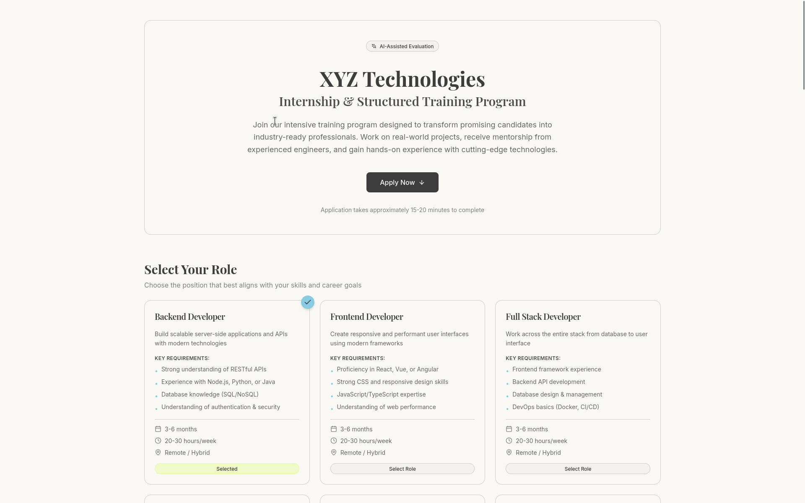
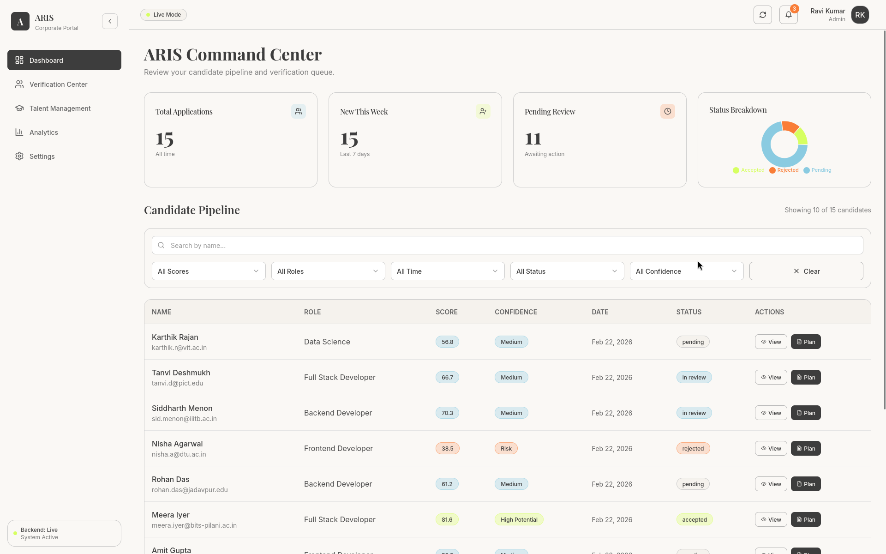
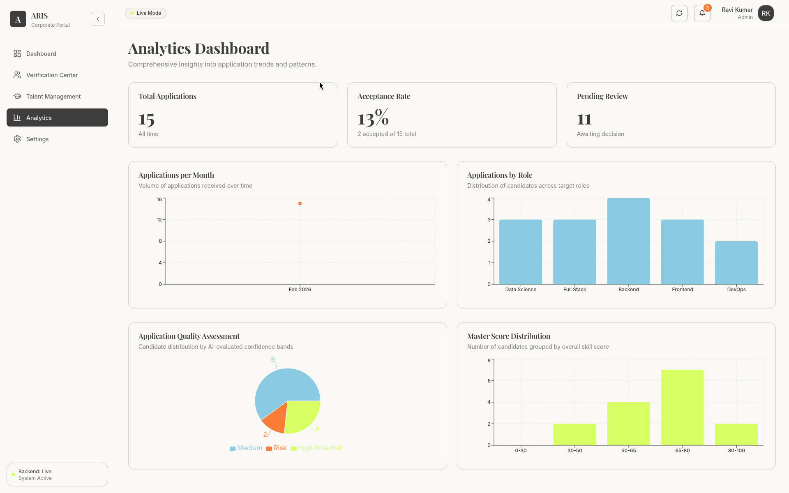
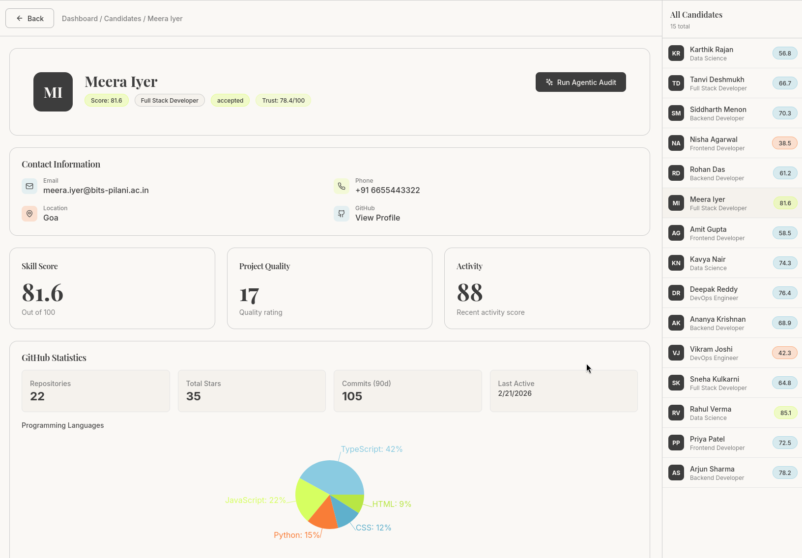
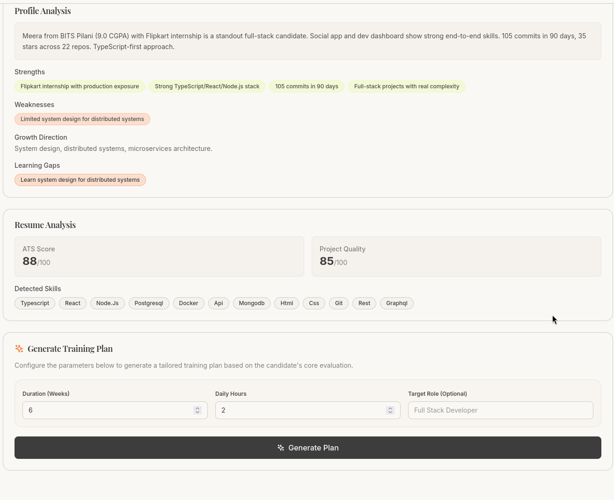
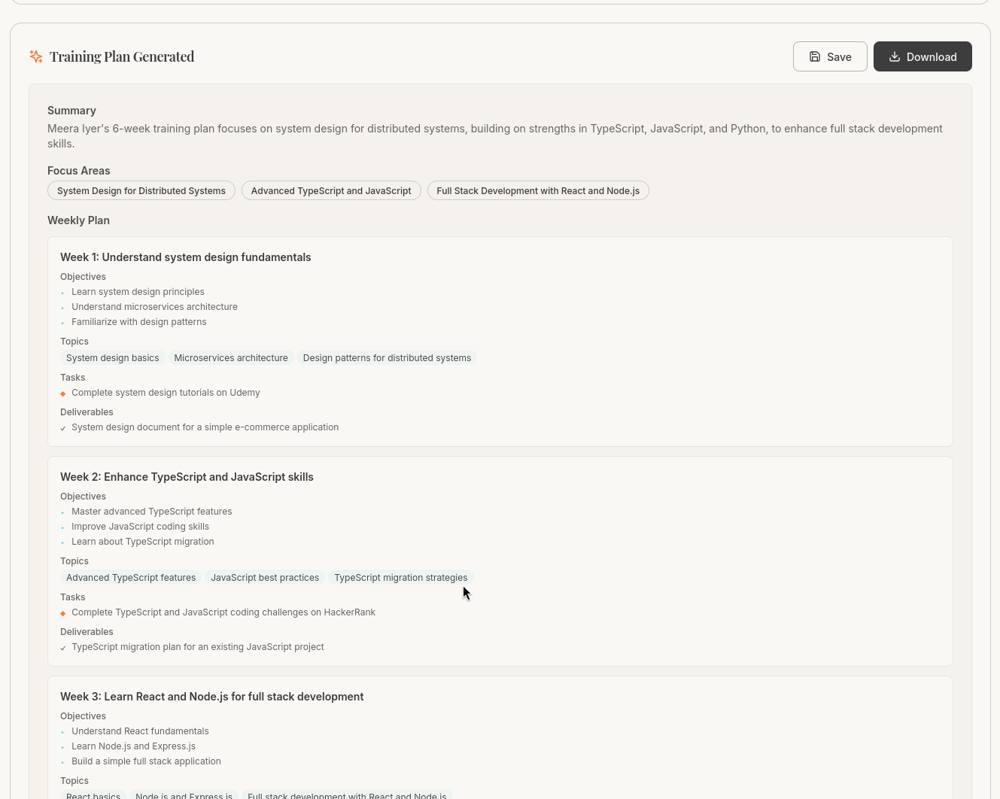
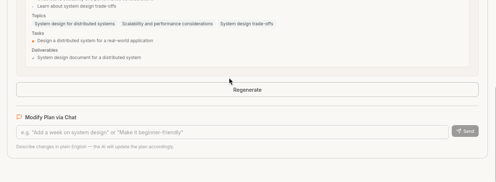

# ARIS — Agentic Background Verification & Enterprise Hiring System

### Made for a hackathon; AI assisted

ARIS is an autonomous candidate verification and recruitment platform that uses multi-agent AI to handle background verification, technical audit, and onboarding roadmap generation.

---

## Overview

ARIS investigates candidate claims instead of just filtering resumes. It cross-references GitHub activity, checks for inconsistencies, and turns the verified profile into an onboarding plan.

## Core Flow

1. **Investigate** - Research the candidate's public presence and activity.
2. **Audit** - Compare GitHub history and code quality against resume claims.
3. **Verify** - Flag red flags, timeline gaps, and skill exaggerations.
4. **Onboard** - Generate a training path based on the verified gaps.

---

## Stack

| Layer | Tech |
|---|---|
| **Agentic Framework** | CrewAI (Multi-Agent System) |
| Backend | FastAPI · PostgreSQL · SQLAlchemy |
| Frontend | React · TypeScript · Vite · Tailwind CSS |
| AI | Groq LLM (llama-3.3-70b-versatile) · GitHub REST API |

---

## Features

- **Agentic Verification** — Multi-agent audit of technical claims and background data.
- **Trust Score Dashboard** — Visualize candidate reliability and technical rank.
- **Deep-Dive Profiling** — LLM-generated analysis of strengths, experience, and red flags.
- **Onboarding Engine** — AI-generated training plans based on verified gaps.
- **Admin Command Center** — Dashboard with filtering and verification logs.

---

## Quick Start

### Backend

```bash
cd backend
python -m venv .venv && source .venv/bin/activate
pip install -r requirements.txt
cp .env.example .env          # fill in LLM_API_KEY and GITHUB_TOKEN
python seed_mock_data.py      # seed enterprise-ready candidate profiles
uvicorn app.main:app --reload
```

### Frontend

```bash
cd frontend
npm install
npm run dev
```

Open `http://localhost:5173` for the Admin Console · `http://localhost:5173/apply` for the Candidate Intake Portal.

---

## Environment Variables

| Variable | Description |
|---|---|
| `LLM_API_KEY` | API key for Groq LLM (llama-3.3-70b-versatile) |
| `GITHUB_TOKEN` | GitHub PAT for technical audit fetching |
| `DATABASE_URL` | PostgreSQL or SQLite connection string |

---

## Screenshots

### Intake Portal


### Admin Dashboard



### Verification Flow



### Training Plans


