## Team Kaizen (team no 45) : yash wandhare, yash nimje, khushi neware, anshuman patil, vedant chamat

# ARIS — Agentic Background Verification & Enterprise Hiring System

ARIS is an autonomous candidate verification and recruitment platform built for the TechAlfa Hackathon. It leverages **Multi-Agent Agentic AI** to automate the most laborious parts of the hiring process: background verification, technical audit, and onboarding roadmap generation.

## What It Is
ARIS is an enterprise-grade hiring platform that replaces manual screening with an autonomous team of AI agents. It doesn't just filter resumes; it investigates them—cross-referencing technical claims against real-world data (GitHub) and detecting inconsistencies using Agentic Reasoning.

## The Problem
Corporate hiring is plagued by "resume padding" and the high cost of manual verification. Technical recruiters struggle to verify if a candidate's claimed experience matches their actual coding output, and senior engineers spend hours auditing candidates who shouldn't have passed the initial screen.

## Our Unique Selling Proposition (USP) — Problem Statement #9
While traditional ATS platforms are static filters, ARIS is **Agentic**. It uses **CrewAI** to orchestrate a specialized team of AI agents that:
1. **Investigate**: Autonomously research candidate's public presence.
2. **Audit**: Compare GitHub commit history and code quality against resume claims.
3. **Verify**: Detect red flags, timeline gaps, and skill exaggerations.
4. **Onboard**: Generate personalized training paths based on verified technical gaps.

## How It Works (Agentic Workflow)

The platform utilizes a **Multi-Agent Crew** to verify every candidate:
1. **GitHub Analyst Agent**: Uses the GitHub REST API to perform a deep-dive into the candidate's active repositories, commit consistency, and language proficiency over the last 90 days.
2. **Fraud Detection Agent**: Cross-references parsed resume text (skills, duration) with the evidence gathered by the GitHub Analyst. It looks for "skill gaps" (e.g., claiming React expertise with 0 React commits).
3. **Compliance Manager Agent**: Synthesizes findings from all specialists into a **Trust Score (0-100)** and a detailed human-readable verification report.
4. **Onboarding Specialist Agent**: Takes the *verified* technical profile and generates a week-by-week curriculum to bridge any missing knowledge gaps.

## Stack

| Layer    | Tech |
|----------|------|
| **Agentic Framework** | CrewAI (Multi-Agent System) |
| Backend  | FastAPI · PostgreSQL · SQLAlchemy |
| Frontend | React · TypeScript · Vite · Tailwind CSS |
| AI       | Groq LLM (llama3-70b) · GitHub REST API |

## Features

- **Agentic Verification** — Multi-agent audit of technical claims and background data.
- **Trust Score Dashboard** — Visualize candidate reliability alongside technical rank.
- **Deep-Dive Profiling** — LLM-generated analysis of strengths, real-world experience, and red flags.
- **Onboarding Engine** — AI-generated personalised training plans based on verified gaps.
- **Admin Command Center** — Enterprise dashboard with advanced filtering and verification logs.

## Quick Start

### Backend

```bash
cd backend
python -m venv .venv && source .venv/bin/activate
pip install -r requirements.txt
cp .env.example .env          # fill in GROQ_API_KEY and GITHUB_TOKEN
python seed_mock_data.py      # seed enterprise-ready candidate profiles
uvicorn app.main:app --reload
```

### Frontend

```bash
cd frontend
npm install
npm run dev
```

Open `http://localhost:5173` for the Admin Console · `http://localhost:5173/apply` for the Candidate Intake Portal.

## Environment Variables

| Variable | Description |
|----------|-------------|
| `GROQ_API_KEY` | API key for Agentic Reasoning (Groq/llama3) |
| `GITHUB_TOKEN` | GitHub PAT for technical audit fetching |
| `DATABASE_URL` | PostgreSQL or SQLite connection string |

---

## Screenshots

### Enterprise Intake Portal
| Step 1 |
| :---: |
| 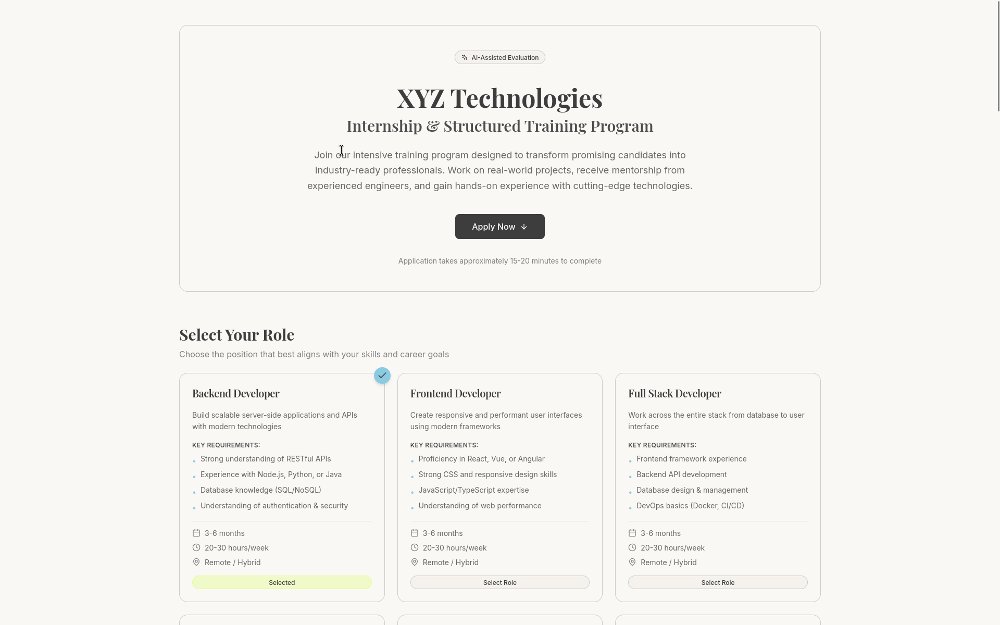 |

### Admin Command Center & Analytics
| HR Overview | Recruitment Analytics |
| :---: | :---: |
| 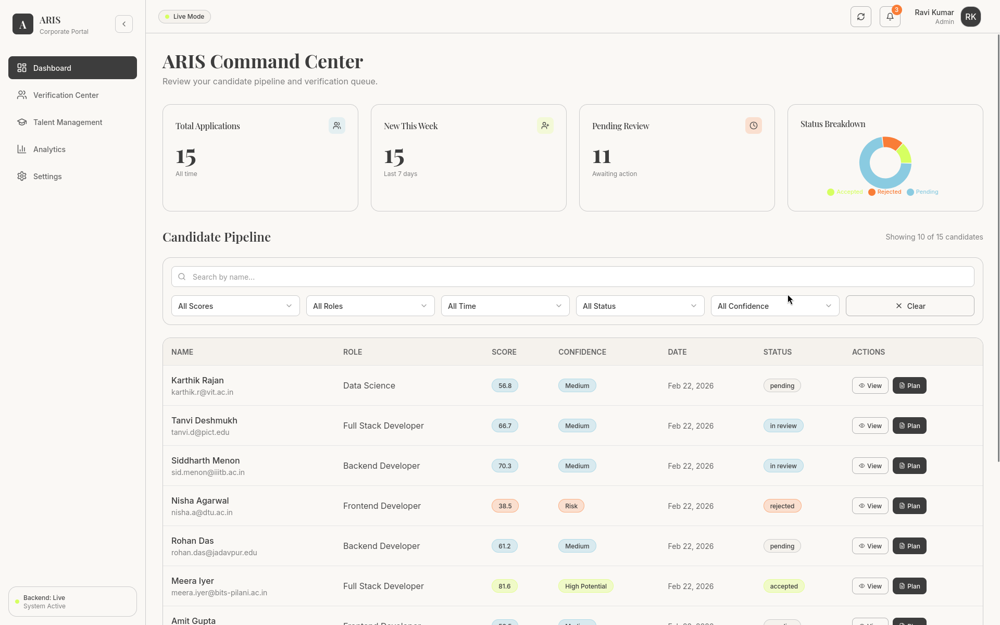 | 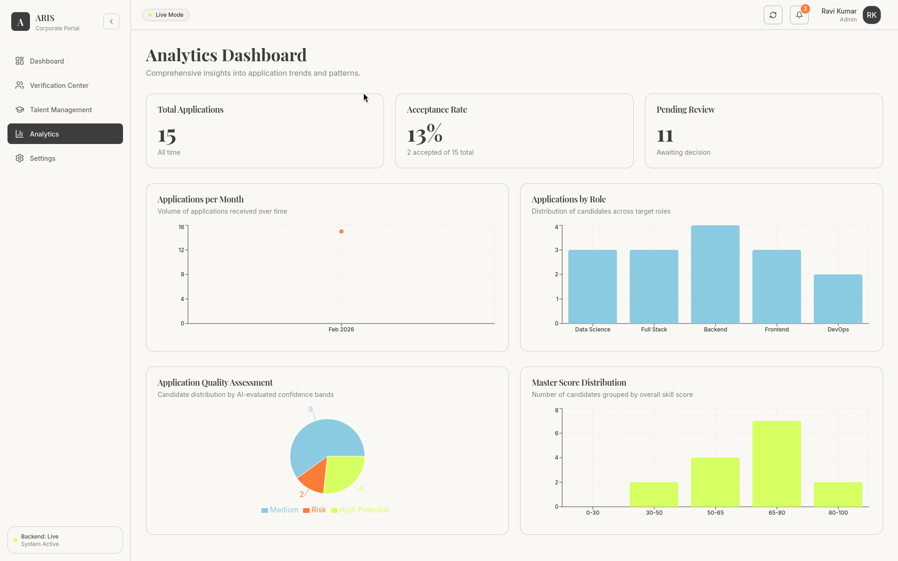 |

| Intern Performance Dashboard |
| :---: |
| 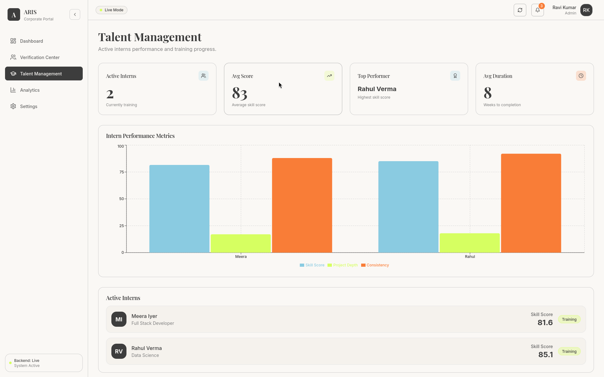 |

### Agentic Verification & Audit
| Deep Dive Verification | Trust Audit Interface |
| :---: | :---: |
| 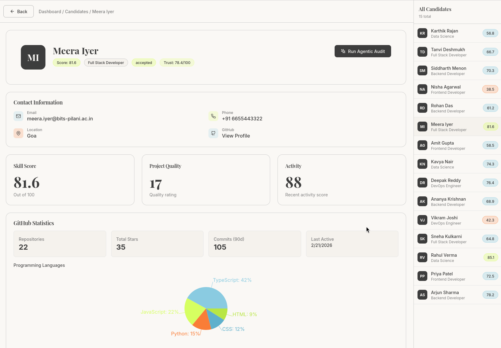 | 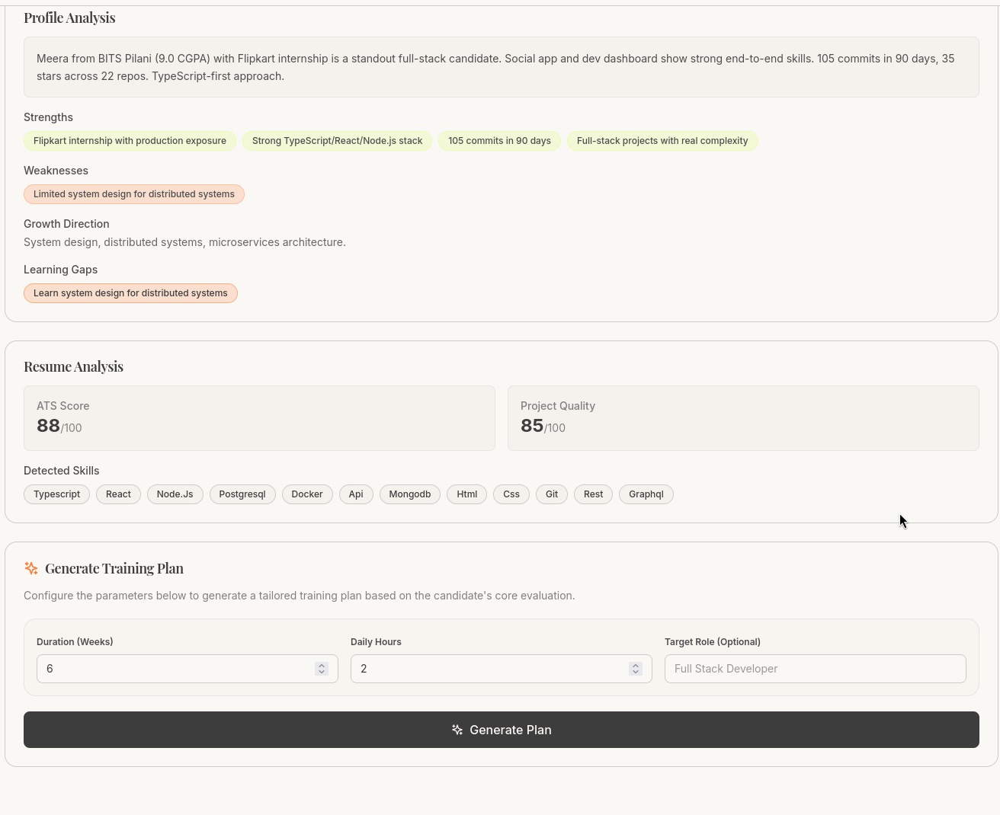 |

| Automated Agentic Audit | Government Verification |
| :---: | :---: |
|  | 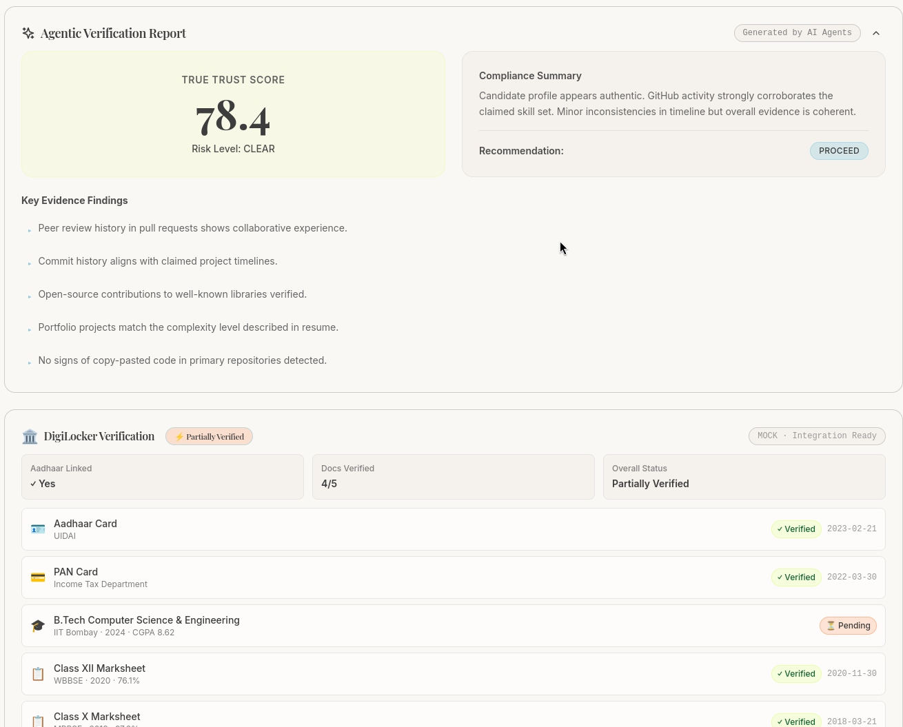 |

### Intern Management & Performance
| Intern View | Performance Monitoring |
| :---: | :---: |
| 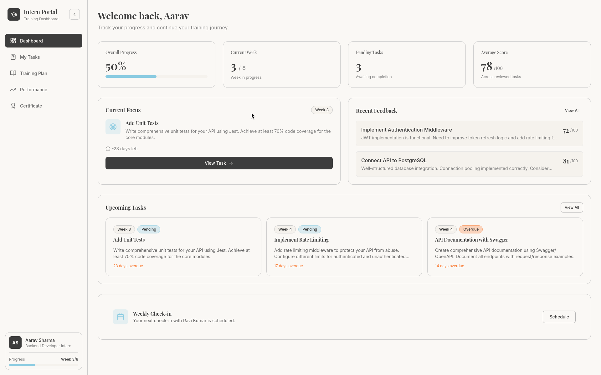 | 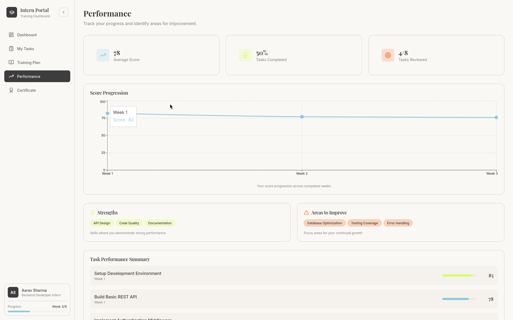 |

### AI Training Plans
| Plan Generation | Interactive Refinement |
| :---: | :---: |
| 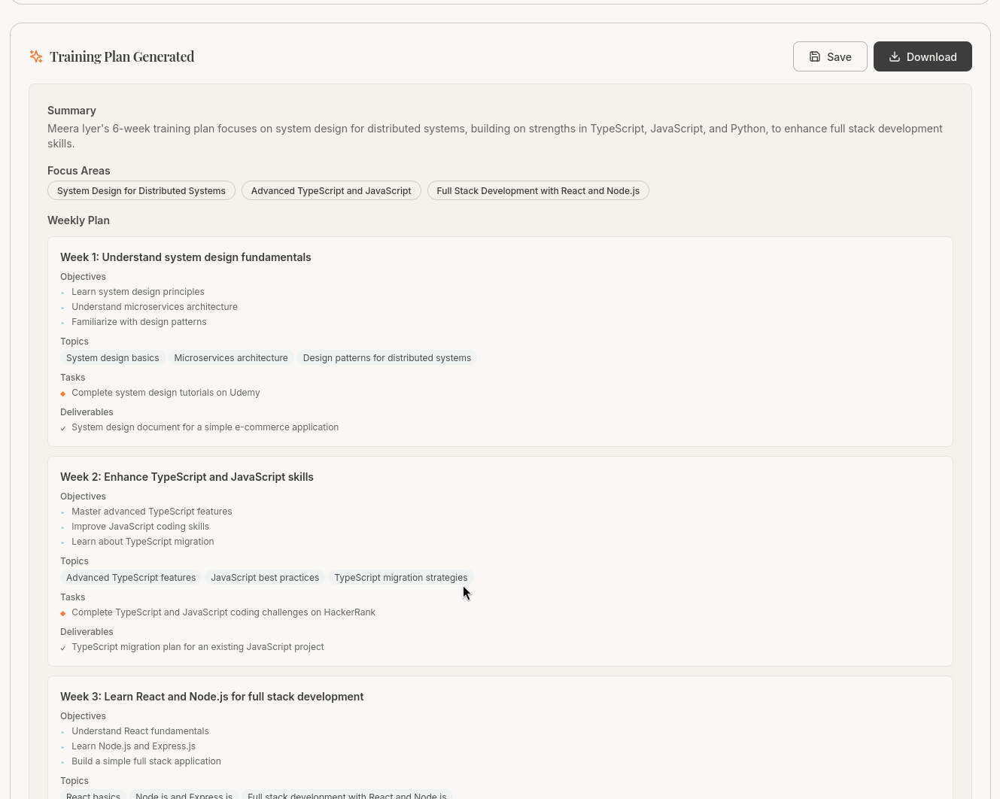 | 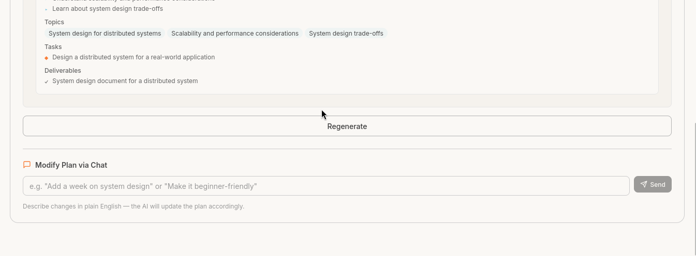 |
